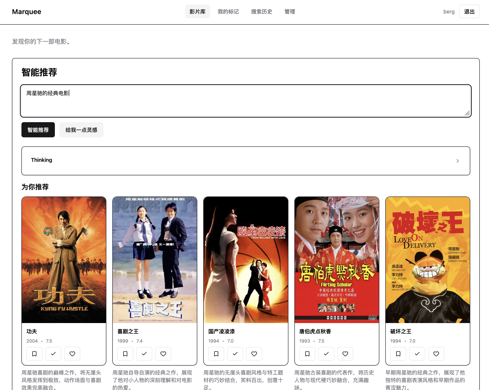

# Marquee

> LLM base，基于本地PT下载的原始电影目录的"整理 + 策展 + 推荐" Web 应用

Marquee 把本地磁盘上的电影目录变成一个可以自然语言提问的私人影片库。输入一句"今晚想看个不费脑子的"，它会用四阶段推荐流水线在几秒内返回 10 部带理由的片子——既有你库里有的，也有系统建议你去找的。

单二进制部署：Rust（Axum + SQLite）后端 + React 前端 + 本地 embedding 模型，`cargo build --release` 一次产出包含所有前端资源的可执行文件。



## 背景

从 PT 站攒下几百上千部电影以后，很容易陷入"找片一小时、看片两小时"的循环：想起一部电影，去豆瓣搜一圈，结果发现自己库里没有，还得再去下；回头在自己的库里翻，PT 种子的文件名又大多不规范，常常得点开好几个才能确认是哪一部。

装 Plex 这样的刮削工具能把元数据补齐，但部署和转码都挺费事，而且它只做整理，不做推荐——"今晚想看个不费脑子的"这类问题还是得靠自己一部一部翻。

LLM 出现以后，这件事可以用一种很轻量的方式解决：本地起一个小服务，自动把目录整理清楚，再让它按自然语言帮你挑片。Marquee 就是为这件事做的。

## 核心能力

- **智能推荐**（SSE 流式）：自然语言 → LLM 理解意图 → SQL / 向量 / 协同三路并行召回 → 多维粗排 → LLM 精排 → 10 部带理由
- **TMDB 自动匹配**：扫描目录 → guessit 风格解析 → TMDB 多语言搜索 → 打分决策（自动确认 / 待审 / 失败）
- **本地语义索引**：fastembed `BGESmallZHV15`（512 维中英双语），LanceDB 嵌入式向量库，无外部 API 调用
- **灵感推荐 + 每日推荐**：首页系统主动提议；每日推荐按日期缓存
- **用户系统**：注册 / 登录 / JWT，个人「想看 / 看过 / 收藏」标记
- **管理后台**：TMDB 误匹配人工纠错、扫描错误审阅、LLM Prompt 模板在线编辑

## 架构

```
config
├── db (models, queries, migrations)           # SQLite + sqlx
├── scanner (walker, parser)                   # 目录扫描 + 文件名解析
├── tmdb (client, matcher)                     # TMDB API + 多语言打分
├── llm (client)                               # OpenAI 兼容 chat
├── embedding (model, store)                   # fastembed + LanceDB
├── search (intent, ranking)                   # QueryIntent + 粗排
├── worker (scheduler)                         # 后台任务调度
├── auth (password, jwt, extractor)            # argon2 + JWT
├── api (movies, recommend, marks, …)          # Axum 路由
├── static_files                               # rust-embed 打包前端
└── main
```

前端在 `web/`：React + TypeScript + Vite + Tailwind + shadcn，构建产物通过 `rust-embed` 打进后端二进制。

## 快速开始

### 依赖

- Rust 1.75+（版本由 `rust-toolchain.toml` 固定）
- Node 20+（构建前端）
- macOS / Linux

### 构建

```bash
# 前端
cd web && npm install && npm run build && cd ..

# 后端（release，自动嵌入前端产物）
cargo build --release
```

产物：`target/release/marquee`（或 `$CARGO_TARGET_DIR/release/marquee`）。

### 配置

```bash
cp marquee.toml.example marquee.toml
```

编辑 `marquee.toml`：

```toml
[scan]
movie_dir = "/path/to/your/movies"   # 扫描根目录（一层子目录 = 一部电影）
interval_hours = 6                   # 后台扫描间隔

[tmdb]
api_key = "your-tmdb-api-key"        # 从 themoviedb.org 申请
language = "zh-CN"
auto_confirm_threshold = 0.85        # ≥ 此分自动确认，否则进待审队列
# proxy = "http://127.0.0.1:6152"    # 可选，墙内通常需要

[llm]
base_url = "http://localhost:11434/v1"  # 任何 OpenAI 兼容接口：Ollama / vLLM / OpenRouter / …
api_key = ""
model = "qwen2.5"

[server]
host = "0.0.0.0"
port = 8080

[database]
path = "./data/marquee.db"
```

### 运行

```bash
./target/release/marquee
# 浏览器打开 http://localhost:8080
```

首次启动会下载 fastembed 模型权重（约 90MB）到本地缓存目录，之后完全本地运行。数据库按 `migrations/` 自动建表。

## 部署

`deploy.sh` 提供一键构建 + 部署脚本，默认目标目录 `$HOME/marquee-runtime/`：

```bash
./deploy.sh
```

流程：编译前后端 → 停旧进程 → 复制二进制 → 启动新进程 → 健康检查。macOS 会做 ad-hoc 签名；Linux 用户可跳过该步骤。

手动部署：把 `target/release/marquee` 和 `marquee.toml` 放到任意目录执行即可，数据库按配置路径自动创建。

## Prompt 模板

`prompts/*.md` 是 LLM 用的 Prompt 模板（中英双版），编译时嵌入二进制。运行时可在管理后台 `/admin/prompts` 按界面语言在线编辑，覆盖保存到 `prompt_overrides` 表，恢复默认即删除覆盖行。

| 模板 | 用途 |
|---|---|
| `query-understand.md` | 自然语言 → `QueryIntent` 结构化意图 |
| `recommend-pick.md` | 50 候选 → 10 推荐 + 理由 |
| `inspire.md` | 生成 10 条灵感短句 |
| `daily-picks.md` | 每日 3 主题 × 5 部推荐 |

## 数据库与迁移

- SQLite 文件路径由 `[database].path` 指定
- 启动时自动应用 `migrations/*.sql`（sqlx 风格编号迁移）
- **不要清空数据库**：TMDB 匹配和人工纠错结果不可再生。如需重置某条记录，使用 unbind API

## 测试

```bash
cargo test                      # 后端单测 + 集成测试
cd web && npm run lint          # 前端 ESLint
cd web && npm run build         # 前端类型检查（tsc）
```

后端集成测试覆盖 auth、movies、recommend、marks、corrections、history 等 API 端到端，以及 scanner、tmdb/matcher、search/ranking 的纯函数逻辑。

## 贡献

欢迎 Issue 和 PR。开发约定：

- 后端代码用英文标识符和注释；UI 文案中英双版（`web/src/i18n/`）
- 提交信息简洁，描述变更动机
- 后端：`cargo fmt` + `cargo clippy -- -D warnings`
- 前端：`npm run lint` 保持无 warning

## License

CC0-1.0
