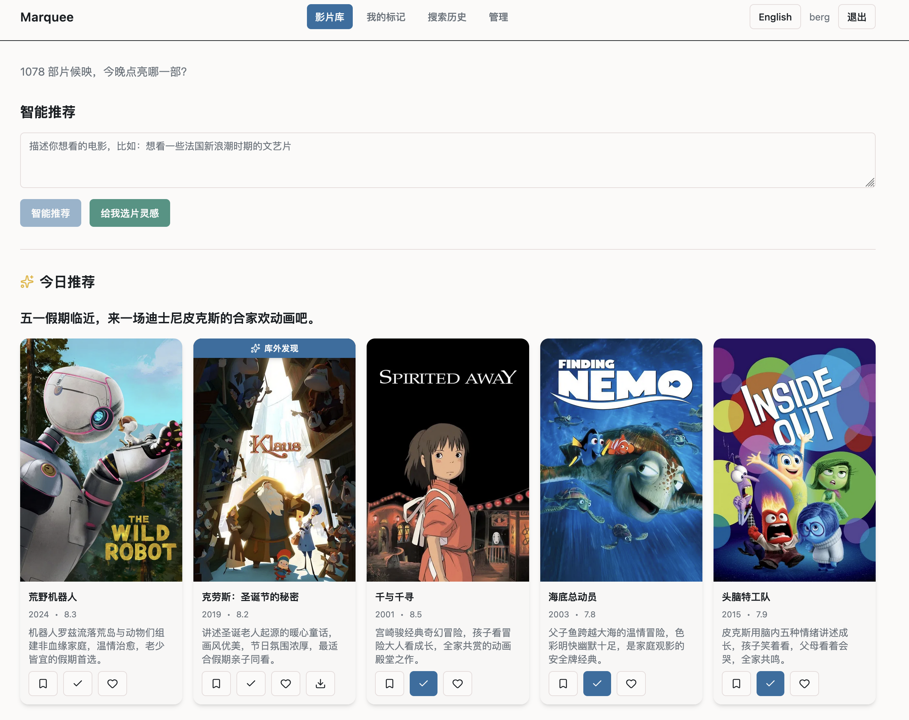

# Marquee

> LLM 驱动的本地影片库整理 + 智能推荐 Web 应用

## 背景

从 PT 站攒下几百上千部电影以后，很容易陷入"找片一小时、看片两小时"的循环：想起一部
电影，去豆瓣搜一圈，结果发现自己库里没有，还得再去下；回头在自己的库里翻，PT 种子
的文件名又大多不规范，常常得点开好几个才能确认是哪一部。

装 Plex 这样的刮削工具能把元数据补齐，但部署和转码都挺费事，而且它只做整理，不做
推荐——"今晚想看个不费脑子的"这类问题还是得靠自己一部一部翻。

LLM 出现以后，这件事可以用一种很轻量的方式解决：本地起一个小服务，自动把目录整理
清楚，再让它按自然语言帮你挑片。Marquee 就是为这件事做的。



输入一句自然语言，Marquee 会用四阶段推荐流水线返回 10 部带理由的片子——既包括库内
已有的，也包括建议你去找的。哪怕是相当抽象的描述（"主角骑自行车的电影"），语义召回
也能找到《偷自行车的人》、《十七岁的单车》这类主题相关的片子，并把库外的相关电影
并列展示出来。所有搜索都可以在「搜索历史」里随时回看，owner 主动 opt-in 后还能生成
公开链接分享给朋友。


## 智能推荐工作流（v0.2 重点演进）

输入一句自然语言，Marquee 在几秒内返回 10 部带理由的片子。整条管线通过 SSE 流式传输，
前端 `ThinkingPanel` 实时展示每一阶段的中间产物（路由判定 / 结构化意图 / 召回池 /
粗排前 50 / LLM 精排），让推荐过程对用户透明。

### Stage 0 — 查询分类（query-classify）

按用户的查询意图把请求分流到 5 条专用路径。每条路径单独优化，避免一个 pipeline
同时应对所有问题：

| 路径 | 触发例子 | 处理方式 |
|---|---|---|
| `exact_title` | "千与千寻"、"教父 2" | 直接通过 TMDB ID 反查，命中即返 |
| `similar_to` | "类似《盗梦空间》的"、"昆汀风格的" | 召回参考物（电影 / 人 / 流派）的语义和协同邻居 |
| `person` | "诺兰的电影"、"梁朝伟主演" | 取这个人的全部作品后调用 person-pick LLM 撰写差异化推荐语 |
| `attribute` | "2010 年代法国 R 级科幻" | 强结构化条件直接 SQL 召回 |
| `descriptive` | "今晚想看个不费脑子的" | 默认路径，进入完整四阶段管线 |

### Stage 1 — 意图理解（query-understand）

把自然语言转换成 `QueryIntent` JSON，包含硬约束（年代 / 国家 / 类型 / 导演 / 演员
/ 关键词）、排除项（例如不要恐怖、不要烂片）、3 条用于向量检索的 search_intents、
以及排序权重。LLM 输出经 schema 校验，非法字段会回退到默认值。

### Stage 2 — 多路召回

四路并行召回，每路有独立的初始语义分基线：

- **结构化召回**：按 SQL constraints 过滤的电影
- **协同召回**：用户「想看 / 看过 / 收藏」过的电影的语义邻居（通过 LanceDB 查找
  相关电影），排除已看过的
- **语义召回**：3 条 search_intents 分别 embedding 后在 LanceDB 取 top-K
- **用户原 prompt 召回**（v0.2 新增）：把用户原句直接 embedding 进入召回，弥补 LLM
  改写过程中可能丢失的语义信号

四路结果汇总去重后送入粗排队列。

### Stage 3 — 多维粗排

把召回池按以下维度加权打分，取前 50 进入精排：评分（Bayesian 加权避免低票数边缘片
淹没真实候选）、流行度、年代偏好、片长、原始语言匹配度、个人标记加成、语义分。

### Stage 4 — LLM 精排（smart-rank）

将 50 部候选交给 LLM，选出 10 部并写简短理由。遵循「诚实原则」：明显不符合用户硬条件
时少给，不强行填满 10 部。

### 旁路工作流

- **inspire**：首页主动给出 10 条灵感短句（基于库统计 + LLM 联想），点击其中一条
  即作为推荐 query
- **daily-picks**：按用户和日期缓存的「今日精选」，经过 Stage 0-4 后缓存一天
- **most-related**：被库内电影通过 TMDB similar / recommendations 关联次数最多但还
  没下载的影片，配 LLM 撰写的推荐 tip
- **movie-insight**：电影详情页的「为什么值得看」短评，异步生成不阻塞主响应

## 使用场景

- **基于库存做发现，快速扩库**：每部入库电影抓 TMDB similar / recommendations，库内电影
  越多，"库外热门"越准——首页底部直接给出"被库内电影关联次数最多但你还没下载的片"，
  点进去看到这部片在你哪些已有电影的相关列表里出现过，作为下一部要找的种子
- **多源目录扫描**：`scan.movie_dirs` 是数组，可同时挂多个本地路径，也可混
  `ssh://user@host/path` 远端目录——SSH 模式下扫描通过 `ssh` 命令读对端目录列表，
  不需要把片子拷到本机；适合 NAS / 远端 PT 盒
- **qBittorrent 集成**：读取下载完成的种子列表，把文件大小、媒体类型（电影 / 剧集 /
  其他）写回对应电影。详情页直接显示哪些种子在跑、各自多大，后台轮询同步
- **豆瓣标记导入**：用 [DouBanExport](https://github.com/UlyC/DouBanExport) 浏览器
  扩展把豆瓣"看过"列表导出为 CSV，上传到管理后台 `/admin/import-douban`。后端按 TMDB
  限速逐条匹配，库内已有打"看过"标记，库外自动新建并抓元数据，未自动确认的进同页
  "待绑定"列表手动选一条 TMDB

## 其他能力

- **TMDB 自动匹配**：扫描目录 → guessit 风格解析（标题 / 年份 / 噪音过滤）→ TMDB 多语言
  搜索（zh-CN + en-US）→ 候选打分（标题相似度 + 年份 ± 阈值 + 流行度）→ 自动确认 /
  待审 / 失败三态
- **本地语义索引**：fastembed `BGESmallZHV15`（512 维中英双语本地模型，无 API 调用）+
  LanceDB 嵌入式向量库
- **TMDB 关键词 / 简介中文化**（v0.2 新增）：runtime 内存字典 + 后台 LLM worker，把
  TMDB 英文 keyword 和库外英文 overview 翻译成中文，显著改善中文 query 的语义召回质量
  （BGE-Small-ZH 单语模型对英文 token 信号弱）
- **用户系统**：注册 / 登录 / JWT，「想看 / 看过 / 收藏」三类标记，搜索历史回看 + owner
  主动 opt-in 公开分享链接
- **反向定位**：详情页"在硬盘里找一下"按钮——在已扫描但未确认匹配的目录里按片名年份
  打分，让你直接挑回正确路径
- **管理后台**：TMDB 误匹配人工纠错、扫描错误审阅、LLM Prompt 模板在线编辑、
  qBittorrent / 扫描器配置在线编辑、Prompt 回归测试套件（Benchmark：题库 + 批量跑 +
  与基线 run 逐题对比 + Recall@K + not_expected_ids）
- **响应式 UI**：移动端顶部菜单改为左侧抽屉，桌面保持水平栏

## 快速开始

### 依赖
- Rust 1.75+（版本由 `rust-toolchain.toml` 固定）
- Node 20+（构建前端）
- macOS / Linux

### 构建
```bash
cd web && npm install && npm run build && cd ..
cargo build --release
```
产物：`target/release/marquee`（或 `$CARGO_TARGET_DIR/release/marquee`），单二进制内嵌前端。

### 配置
```bash
cp marquee.toml.example marquee.toml
```
编辑 `marquee.toml`：

```toml
[scan]
movie_dirs = [                       # 一层子目录 = 一部电影；可混本地路径和 SSH 远端
  "/path/to/your/movies",
  # "ssh://user@host/path/to/movies",
]
interval_hours = 6
# ssh_key_path = "/path/to/id_ed25519"   # 可选；留空依次回落 ~/.ssh/{id_ed25519,id_rsa,id_ecdsa}

[tmdb]
api_key = "your-tmdb-api-key"        # 从 themoviedb.org 申请
language = "zh-CN"
auto_confirm_threshold = 0.85
# proxy = "http://127.0.0.1:6152"    # 可选

[llm]
backend = "openai"                      # "openai"（默认）或 "claude-cli"
base_url = "http://localhost:11434/v1"
api_key = ""
model = "qwen2.5"

[server]
host = "0.0.0.0"
port = 8080

[database]
path = "./data/marquee.db"

[qbittorrent]
enabled = false
base_url = "http://localhost:8080"
username = "admin"
password = ""
save_path = "/volume1/movie"         # 与 scan.movie_dirs 中某一项对齐
poll_interval_hours = 6
```

### 运行
```bash
./target/release/marquee
# 浏览器打开 http://localhost:8080
```

首次启动会下载 fastembed 模型权重（约 90MB）到本地缓存目录，之后完全本地运行。
数据库按 `migrations/` 自动建表。

## 部署

把 `target/release/marquee` 和 `marquee.toml` 放到任意目录执行即可——所有前端资源
通过 `rust-embed` 内嵌在二进制里。数据库会按配置路径自动创建。

systemd / launchd / nohup 任选一种把进程托管起来。如果在 macOS 跨机分发，记得做
ad-hoc 签名（`codesign --sign - --force ./marquee`）。

## Prompt 模板

LLM 模板存于 `prompts/*.md`（中英双版，编译时嵌入二进制）。运行时按界面语言加载，
管理后台 `/admin/prompts` 在线编辑——覆盖保存到 `prompt_overrides` 表，恢复默认即
删除覆盖行。

| 模板 | 用途 | 在 v0.2 的变化 |
|---|---|---|
| `query-classify` | Stage 0 路由 5 路分类 | v0.2 引入 |
| `query-understand` | Stage 1 自然语言 → QueryIntent | zh prompt 强制 search_intents 用中文 |
| `smart-rank` | Stage 4 50 → 10 精排 + 理由 | reason 解析改为宽松模式（容忍未转义双引号） |
| `person-pick` | person 路径写差异化推荐语 | v0.2 引入 |
| `inspire` | 首页 10 条灵感短句 | — |
| `most-related-tip` | 库外热门首页 LLM tip | v0.2 引入；异步生成不阻塞响应 |
| `movie-insight` | 电影详情页"为什么值得看"短评 | v0.2 引入 |

`keyword-translate.md` / `overview-translate.md` 是后台 worker 内嵌模板（不可编辑），
负责 TMDB 英文 keyword / overview 自动翻译成中文写回数据库。

## 数据库与迁移

- SQLite 文件路径由 `[database].path` 指定
- 启动时自动应用 `migrations/*.sql`（sqlx 风格编号迁移）
- **不要清空数据库**：TMDB 匹配和人工纠错结果不可再生。如需重置某条记录，使用 unbind API

## 测试

```bash
cargo test                      # 后端单测 + 集成测试
cd web && npm run lint          # 前端 ESLint
cd web && npm run build         # 前端类型检查（tsc）
```

后端集成测试覆盖 auth、movies、recommend、marks、corrections、history、benchmark
等 API 端到端，以及 scanner、tmdb/matcher、search/ranking 的纯函数逻辑。

## 贡献

欢迎 Issue 和 PR。开发约定：
- 后端代码用英文标识符和注释；UI 文案中英双版（`web/src/i18n/`）
- 提交信息简洁，描述变更动机
- 后端：`cargo fmt` + `cargo clippy -- -D warnings`
- 前端：`npm run lint` 保持无 warning

## License

CC0-1.0
